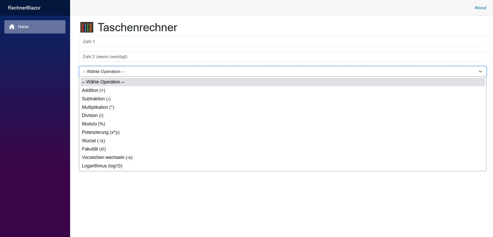
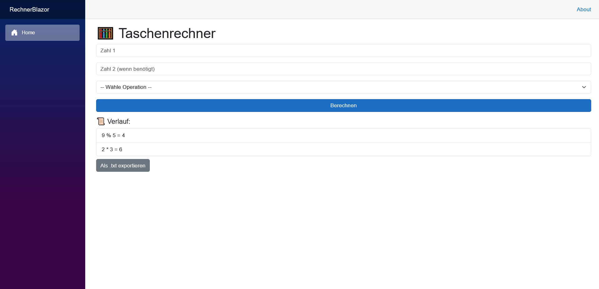

# .NET with Blazor

This is a starter project for using .NET with Blazor.  
**GUI**: Blazor  
**Framework**: .NET  
**Programming Language**: C#

---

## 🖼️ Program Appearance
  



---

## ✅ 1. Install Prerequisites

### 🔧 1.1 Install .NET SDK
- Visit: [https://dotnet.microsoft.com/download](https://dotnet.microsoft.com/download)
- Download and install the latest **.NET SDK** (not just the Runtime) — use **.NET 8**
- After installation, verify:

```dotnet --version```

### 📦  Install Required Package
dotnet add package Blazored.LocalStorage


### 🔧 1.2 VSCode Extension
- Install: C# Dev Kit (recommended)


## 🧱 2. Structure of a Blazor WebAssembly Project
RechnerBlazor/
├── Program.cs
├── wwwroot/
├── Pages/
│   └── Index.razor ← this is where we build the calculator
├── Components/
│   └── RechnerForm.razor
│   └── VerlaufListe.razor
└── App.razor


## ▶️ 3. Start the Project (Terminal)
```dotnet run```

Blazor will launch a local web server, for example:  
Now listening on: https://localhost:7213  
Open the URL in your browser — your calculator is online! 🎉

## 🛠️ Create a New Blazor WebAssembly Project
```dotnet new blazorwasm -n ProjektName```
```cd ProjektName```
```code .```
